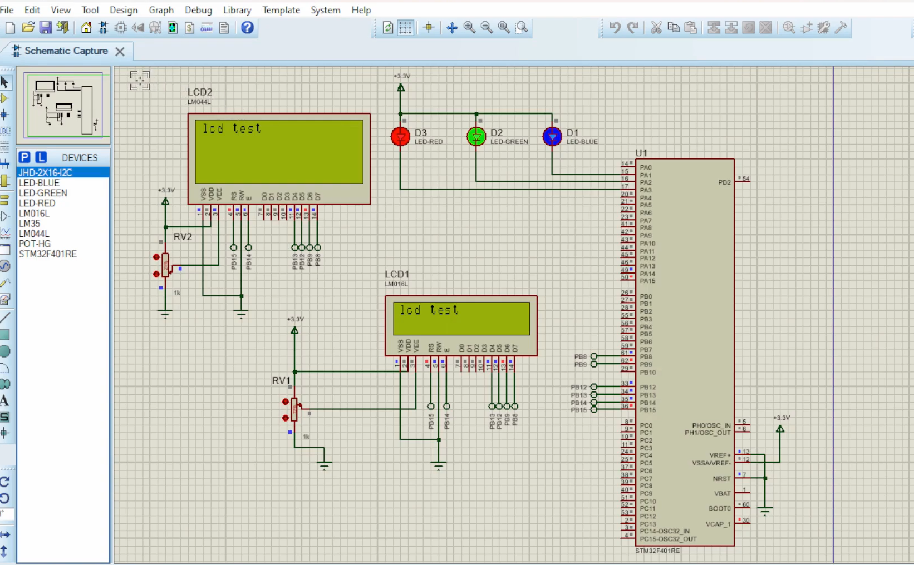

# STM32 LCD and LED Control (Simulation-Only)

This project demonstrates how to simulate an STM32F401RE microcontroller interfacing with:
- A 20x4 Character LCD (LM044)
- Red, Green, and Blue LEDs  
using STM32CubeIDE and **Proteus** simulation — **no hardware is required**.

## 🧠 Project Summary
- Displays **"LCD Test"** on the LCD using 4-bit communication mode.
- Blinks Red, Green, and Blue LEDs with delays.
- Developed using **STM32 HAL** libraries.

---

## ⚙️ Tools Used
- 🛠 **STM32CubeIDE** – Code development and build
- 💡 **Proteus 8 Professional** – Circuit simulation (no physical board needed)
- 📦 **HAL Library** – STM32F4xx Hardware Abstraction Layer

---

## 🧩 Features
- LCD initialization and string printing
- GPIO toggling to blink LEDs
- Software delay for timing
- Fully simulated using Proteus

---

## 🔌 Hardware (Simulated in Proteus)
- STM32F401RE (MCU Model in Proteus)
- LM044 LCD (20x4 or compatible)
- 3 LEDs (Red, Green, Blue) with resistors
- Potentiometer for LCD contrast
- External Crystal and Reset Circuit (if needed for realism)

---

## 📁 Project Files
- `Core/Src/main.c` – Main logic for LED blinking and LCD output
- `lcd.c`, `lcd.h` – Custom 4-bit LCD driver
- `schematic.png` – Circuit diagram used in Proteus
- `.ioc` file – CubeMX configuration file (if applicable)

---

## 🧪 How to Simulate
1. Open the project in **STM32CubeIDE**.
2. Build and compile the project to generate `.hex` file.
3. In **Proteus**, load the `.hex` into STM32 model.
4. Run simulation – LCD will display text, and LEDs will blink in sequence.

---

## 📌 Notes
- This project does **not require real hardware**.
- Perfect for learning STM32 basics, GPIO control, and LCD interfacing in simulation.
- You can later migrate to real hardware if needed.

---

## 📷 Circuit Schematic  


---

## 📤 GitHub Repository Instructions
1. Clone the repository:
   ```bash
   git clone https://github.com/yourusername/STM32_LCD_LED_Simulation.git
